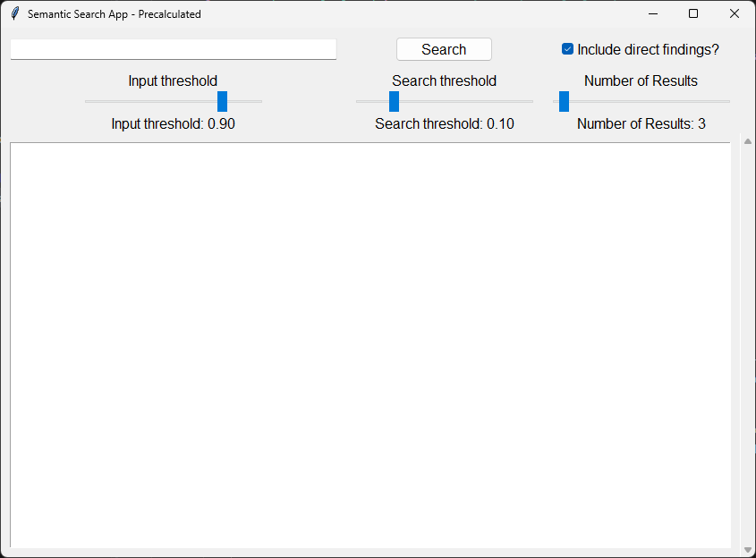
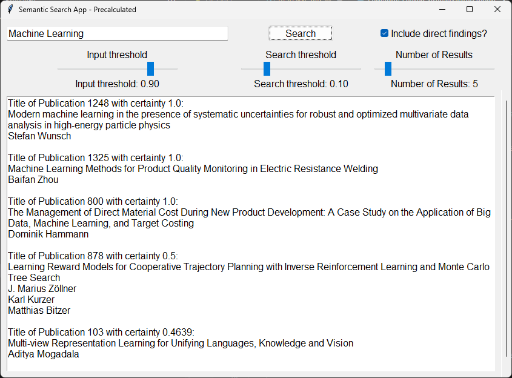

# Bachelor Thesis "Ontologie-basierte Semantische Suche nach Kompetenzen in einer Datenbank von Ver-öffentlichungen"


## Description
This project was implemented for a bachelor thesis at the [Institut für Angewandte Informatik und Formale Beschreibungsverfahren (AIFB)](https://aifb.kit.edu/web/Hauptseite) at the [Karlsruher Intitur für Technologie (KIT)](https://www.kit.edu/). It was done as part of the Kompetenzpool that is part of the [Kompetenznetzwerk](https://www.kit.edu/forschen/kompetenznetzwerk.php).
The goal of the thesis was to implement this prototype of a semantic search. It allows a user to search for competencies in a keyword-based search. As a result the user is shown publications from the computer science and material sciense departments of the [KIT](https://www.kit.edu/) with their authors. The publications are supposed to fit the requested search query, meaning they should contain these competencies or be semantically similar.    
In general an ontology was created from competencies that were extracted from scientific publications. In this ontology the semantic search was implemented in two ways. One using indididual calculations and an optimized verison using precalculated similarities.

## Semantic Search UI



With results:



## Installation
To install and use this project download the files and install the [requirements](requirements.txt) with the commands:

```bash
git clone https://github.com/username/repository.git
cd repository
pip install -r requirements.txt
```

## Usage
To use the semantic search open one of the semantic_search files in the semantic-search folder and run them.     
The [semantic_search_individual_calculations](semantic-search/semantic_search_individual_calculations.ipynb) file runs the first and slower semantic search. The [semantic_search_precalculated](semantic-search/semantic_search_precalculated.ipynb) file runs the optimized and faster semantic search. To test the semantic search the **optimized search** is recommended.

### Sliders
There are three sliders and one checkbox to make some adjustments to the semantic search settings:
-   The **Input threshold** determines how closely a competency has to match parts of the search query (measured with the Levenshtein-distance) to be included in the search. Values **above 0.8** are recommended.
-   The **Search threshold** determines how high an extraction has to be weighed, to be included in the search. For the optimized semantic search it determines the minimum weight of a similarity. Values **below 0.3** are recommended.
-   The **Number of results** determines how many results should be shown. This influences the run time immensely. Should the search have to determine lots of results it takes way longer. Therefore values **below 20** are recommended.
-   The **Include direct findings** checkbox determines weather the initial publications should be included in the results. These are the publications from which at least one of the competencies of the search query was extracted. Unchecking the box increases the run time and excludes the best matching publications. Therefore it is recommended, that this box is **only checked for curiosity and evaluation** regarding the search algorithm.

## Structure of the project
The project ist structured in three folders.
Most of the code is written in jupyter notebooky (.ipynb files) because it has to be executed only once (for example to create the ontology).
    
-   ### The [**ontology folder**](ontology) contains various ontologies and visualizations of them.


-   ### The [**ontology_creation folder**](ontology_creation) contains all files necessary for creating the ontology. This includes   
    - the databases folder, which contains all databases of the publications and the files for the predefined competencies of ocmputer science and chemistry.   

    - the competency-cleaning file, which takes the competencies for [computer science](ontology_creation/databases/competences-computer-science.txt) and [chemistry](ontology_creation/databases/competences-chemistry.txt), processes them and saves them into the csv files for [computer science](ontology_creation/databases/computer-science.csv) and [chemistry](ontology_creation/databases/chemistry.csv).

    - the the database-creation file, which created the [database](ontology_creation/databases/publications-database.db) and fills it with the content from the [database from another project](ontology_creation/databases/database-kool.db).

    - the ontology-creation file, which is responsible for extracting the competencies from the publicaitons and creating the ontology.

    - the ontology-creation-visualization file, which is very similar to the ontology-creation file but is uses to create onty parts of the ontology and visualize them. It generates images of the parts of the ontology.


-   ### The [**semantic_search folder**](semantic-search) contains all files necessary for the semantic search. It includes
    -   the semantic_search files for the [indidual calculations](semantic-search/semantic_search_individual_calculations.ipynb) and the [precalculated](semantic-search/semantic_search_precalculated.ipynb) ones, which contain the GUIs for the semantic searches. To test the searches run these files. 

    -   the search files for the [indidual calculations](semantic-search/search_individual_calculations.py) and the [precalculated](semantic-search/search_precalculated.py) ones. These files contain the classes of the semantic searches. The search algorithms are implemented in these. 

    -   the [create_pickles_files](semantic-search/create_pickle_files.ipynb) file, which creates the presaved pickle files that represent the search objects used in the semantic searches. This reduces the run time of the instantiation. In this file the optimized ontology with precalculated similarities is generated and saved. 

    -   the [temporary-storage](semantic-search/temporary-storage/) folder, which contains some files that are needed for the semantic search.

    -   the [database_adapter](semantic-search/database_adapter.py) file, which provides methods to access the [database](ontology_creation/databases/publications-database.db).

    -   the [util](semantic-search/util.py) file, which pprovides some functions and a class used in the other files.

    -   the [evaluation](semantic-search/evalutation.ipynb) file, which was used to evaluate the semantic searches and compare them with a simple substring search.

## Support
For questions regarding the project contact <uofdk@student.kit.edu>.

## Authors and acknowledgment
This project was created by Moritz Spohn.

I would like to express my appreciation to the supervisors of the bachelors thesis Martin Forell and Demian Frister.

## License
This project is licensed under the **GNU GENERAL PUBLIC LICENSE** - see the [LICENSE](LICENSE) file for details.

## Project status
The prototype of the semantic search is finished. It serves as a guideline to implement a semantic search in a live environement.   
If the semantic search were to be implemented in a live environement, there would be some necessary changes. The most notable change would have to be the connection to the database in the [ontology creation file](ontology_creation\ontology-creation.ipynb), which would have to be completely revamped. The functions to add instances to the ontology might have to be adapted.
If a similar search were to be implemented in an ontology of the same structure and format, the searches from the [semantic-search](semantic-search) folder can be reused.